# DDIM Denoising Diffusion Implicit Model Implementation & Conditioned-Model CFG (Classifier-Free Guidance)

## Forward Process
𝝱 in the range [0.0001, 0.02] and set the total timesteps T = 1000

X0 is the original picture

ϵ is adding noise to the picture in the from of N(0,1)

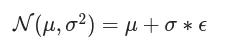

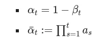

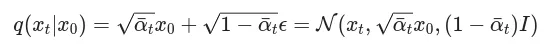

## Reverse Process
ϵθ​(x_t​,t) is model’s output. Network is trying to denoise and predict the image from the existing noise.

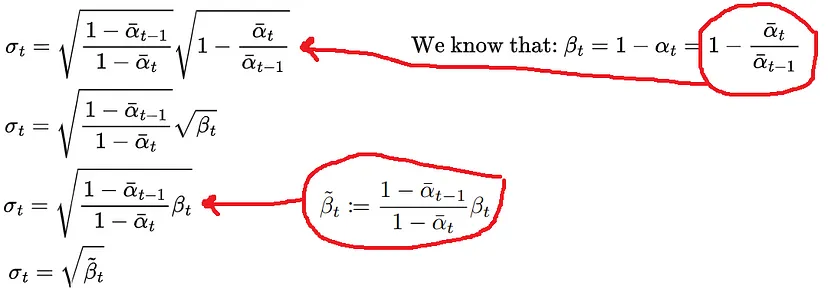

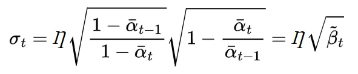

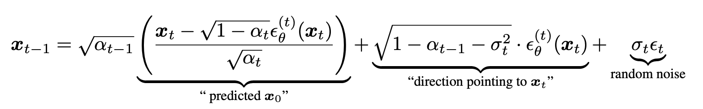

when σ = 0, it becomes deterministic like DDPM

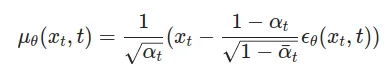

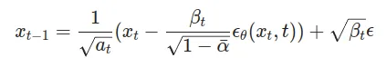

## Training Loss MSE "ELBO"

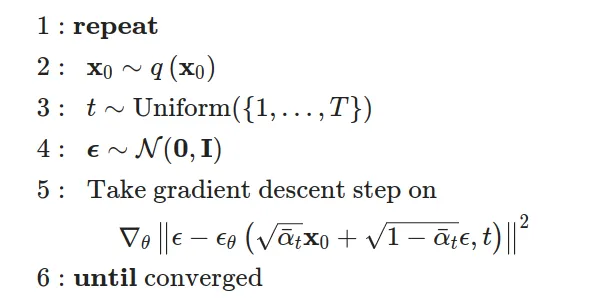

Same as forward process => 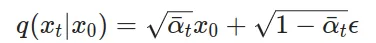

## Dataset used
[AFHQ Animals Dataset](https://huggingface.co/datasets/huggan/AFHQ)

## Results

FID Score ~= 4

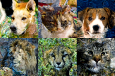

# Using Classifier-Free Guidance (Conditioned Generation)

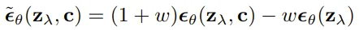

## Results

Using conditions of cat & dog

FID Score ~= 4

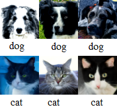

### Disclaimer:
1. All of the code is inside the Jupyter notebook file.
2. Parts of the code are copied from unsolved assignments of Prof. Minhyuk Sung @ KAIST, a graduate course about diffusion models.
3. Work is done during KAUST internship with KAUST GPUs @ Prof. Mohamed Elhoseiny Lab, as part of the learnings to create a diffusion project.
